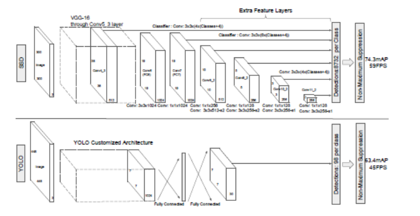
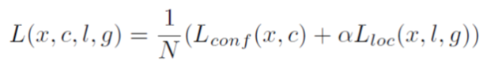
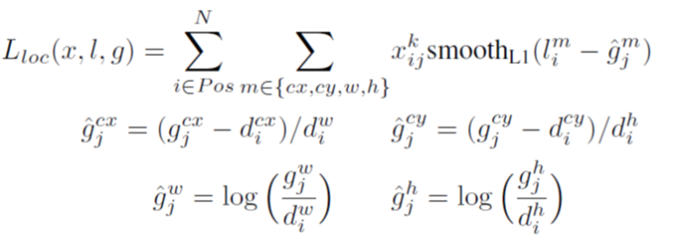
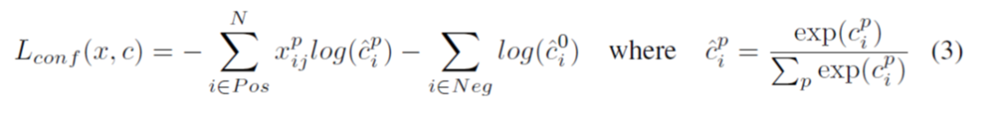

# Single Shot Detector 

### Introduction

-  SOTA Object detection 알고리즘은 대강 정의된 bbox에서 feature를 뽑아 classifier를 사용하는 방식  
-  예를 들면 Faster R-cnn 이 있는데.. 무지 느림(계산량이 어마어마)
-  대략 Frame per second로 보면 7FPS정도
-  SSD는 59FPS에 74.3% mAP로 기존 모델들 보다 속도도 빠르고 정확도도 높음
-  속도 향상의 가장 큰 이유는 RPN을 없앤 것(feature resampling stage도 없앰..?)
-  SSD는 ratio가 다른 box에 대해서 여러개의 predictor를 사용하여 성능을 높임. predictor는 convolution으로만 이루어져 있음
- high scale feature와 low scale feature를 모두 이용

### Single Shot Detector
##### Model

- Imagenet 같은 곳에서 많이 사용된 network의 classifier부분만 제거하고 사용됨-> truncated network(논문에서는 VGG 사용)
- __Multi Scale feature maps for detection__ : truncated network에 convolution layer를 추가. 이는 multiple scale prediction에 사용됨
- __Convolutional predictors for detection__ : 추가된 feature layer로부터 고정된 size의 prediction을 낼 수 있다. (convolution layer를 사용함)  
만약 feature map 크기가 m\*n\*p 라면, 3\*3\*p의 convolution filter를 사용해서 예측을 하게 됨
- **Default boxes and aspect ratios** : convolution filter가 예측값을 생성해 낼 때, 각 cell 별로 default box가 할당된다. 3\*\3 filter가 도므로 결국 feature map의 픽셀 하나 당 default box가 붙게 된다. 만약 cell별로 k개의 box가 할당된다면, box당 예측값은 c(class 수 + background class) + 4(bbox offset)이므로, k(c+4)개가 되고, m\*n에 걸쳐 위치별로 생성되므로 최종 convolution filter의 output은 k(c+4)mn이 된다. 

* SSD architecture

* 38\*38 , 19\*19, 10\*10, 5\*5, 3\*3 size의 feature map에서 각각 prediction을 수행함(FC layer를 사용하는 YOLO와 달리 convolution layer만 사용해서 속도가 향상됨) 

##### Training
- The key difference between training SSD and training a typical detector that uses region proposals, is that ground truth information needs to be assigned to specific outputs in the fixed set of detector outputs.(무슨소리..?)
- **Matching strategy** : 각 cell별로 여러 개의 default box가 존재하고, 이를 ground truth와 매칭시켜야 하는데, 전부 할 수는 없으므로 jaccard overlap(IOU)가 0.5이상인 default box만 training에 사용한다.
- **Training Objective** :   
  xpij  = {1, 0} : i번째 default box가 j번째 ground truth box에 매칭됨을 의미
  전체 Loss는  
    
  즉 confidence loss와 location loss의 weighted sum  
  각 loss의 식은
  
    
  N : number of matched box  
  c첨자 : center를 의미  
   
- **Choosing scales and aspect ratios for default boxes** :   
  특이한 식을 통해서 default box의 기본 length s를 정하고, aspect ratio는 {1, 2, 3, 1/2, 1/3}을 사용함  
  wak = s$\sqrt{a}$  
  hak = s/$\sqrt{a}$   

- **Hard negative mining** : matching step 이후, 대부분의 default box는 background로 처리됨. 이렇게 되면 class imbalance가 심화되어 3:1로 샘플링해서 사용

- **Data augmentation** : 각 이미지마다 아래 세 가지 옵션 중 하나를 랜덤하게 적용함   
  - 전체 이미지 사용
  - 최소 IOU가 0.1, 0.3, 0.5, 0.7, 0.9가 되게 random patch
  - random patch
  각각의 patch는 원본 이미지로 resize되고 horizontal flip을 1/2확률로 적용