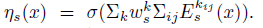
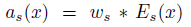
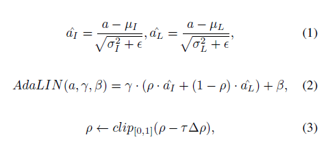
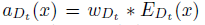
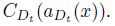
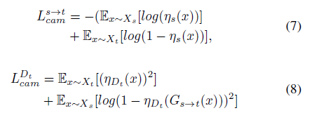
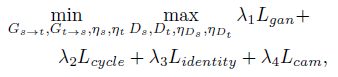

# U-GAT-IT

### abstract 
- 기존 Image to Image translation 에 attention module과 learnable parameter를 가진 normalization 기법을 적용한 방법
- attention module은 각 도메인간의 차이가 큰 부분을 집중해서 변환하게 하는 효과를 가진다
- 여기서 제안하는 AdaLIN은 model이 얼마만큼 이미지를 변환해야 할지를 스스로 학습하게 하는 역할

### Introduction
- cyclegan, discogan 등 여러 image translation 관련 알고리즘이 나와서 많은 성과를 보였지만 selfie2anime, cat2dog와 같은 wild image(?) 혹은 shape 변화가 큰 task에서는 성공적인 결과를 보이지 못함.
- UNIT, MUNIT 다음 나온 DRIT으로도 cat2dog와 같이 shape 변화가 있는 task는 결과가 그리 좋지 않았다. 심지어 horse2zebra도 좋은 결과를 보이지 못함
- 이 논문에서는 attention과 새로운 normalization을 활용한 아키텍쳐를 제안하려고함. 
- 기존에 attention을 활용한 image translation 기법이 있었지만 이는 cropped 이미지를 변환하는 방식이었기 때문에 shape를 변환할 수 없었음
- 이 논문에서의 attention은 domain을 구분하는 데 중요한 부분, 중요하지 않은 부분을 네트워크가 aux classifier로부터 알아서 학습하게 함. 상대적으로 중요한 region에 집중하면서 shape transform을 촉진
- 이와 더불어 normalization method의 선택이 중요하다는 것을 실험을 통해 확인했고, 이에 AdaLIN method를 아키텍처에 적용
- adaLIN이란 IN과 LN을 적절한 비율로 섞는 것이고, 그 비율을 adaptive(training 과정에서 학습)하는 것
- adaLIN이 shape와 texture의 변화 정도를 조절하게 됨

### U-GAT-IT 설명
##### notation
Gs->t : source to target을 의미하는 generator  
Xs : source domain  
Xt : target domain  
Ds : source domain Discriminator  
Dt : target domain Discriminator  
$\eta$s : G의 aux-classifier(input이 해당 domain에 속하는 image인지 판단)  
Es : Gs->t의 encoder  
Gt : Gs->t의 decoder  
$\rho$ : AdaLIN에서 IN과 LN의 가중평균을 구할 때 사용할 weight  
EDt : Discriminator의 encoder
CDt : Discriminator의 classifier

discriminator의 attention은 G가 real image를 생성하는데 중요한 region에 포커스를 맞추도록 하는 역할  
G의 attention은 다른 domain과 구별되는 region에 집중하도록 하는 역할(?)

##### Generator
- Generator 는 Encoder, Decoder, aux classifier로 구성되어 있다. 여기서 classifier는 input 이미지가 해당 domain에 속하는지를 학습한다.(그냥 라벨 1로 놓고 학습하는 것으로 보임)
- classifier는 CAM과 같은 구조를 지니는데, Encoder에서의 마지막 feature map에서 GAP와 GMP를 거친 다음 FC 레이어를 거치게 된다. 이 때 GAP 후 fc 레이어의 weight를 통해 feature map의 중요도를 학습한다.  
- 이 weight와 feature map을 통해 attention map을 구할 수 있는데, 이는 w*E(x)로 구할 수 있다. (x는 input image, E는 Encoder의 feature map, w는 FC layer의 weight)  
- attention map을 Generator의 Decoder input으로 사용한다. decoder에서는 AdaLIN을 사용한다.  
  
aux classifier  
 
attention map  
 
AdaLIN  
 

##### Discriminator
- encoder, classifier, aux classifier로 구성되어 있다.  
- Generator와 마찬가지로 Encoder를 통해 뽑은 feature map으로 aux classifier를 학습, feature map별 importance를 구하고, 이를 이용한 attention map으로 classifier를 학습시킨다. (굳이 Discriminator에도 attention을 적용한 이유는 잘 모르겠음..)

attention map  
 
Dt(x) =  

##### Loss function
- Adversarial Loss : LSGAN의 loss function 사용(L2 Loss)
- cycle loss : cycleGAN의 L1 loss 사용
- Identity loss : cycleGAN의 identity loss 사용
- CAM loss : generator의 aux classifier는 NLLLoss 사용하고, Discriminator의 aux classifier는 L2 loss 사용  
 
전체 loss function은    
 

### Network Architecture
논문 Appendix 참조

### training
- Adam(0.5, 0.999) 사용
- random Horizontal flip 및 286x286 이미지를 256x256으로 random crop하는 augmentation 적용
- 0.0001로 500,000iteration 학습 후 다음 500,000 iteration에서 linear decay
- N(0, 0.02)로부터 weight initialization

### Dataset(selfie2anime)
- selfie dataset은 46,836장으로 구성되어 있고, 이 중 3400장을 training, 100장을 test용으로 선택함
- anime-planet.com에서 69,926장의 이미지를 lbpcascade를 이용하여 얼굴부분만 추출
- 27,023장의 사진이 추출되고, 이로부터 selfie data와 똑같은 수로 이미지를 sampling(여자사진만 사용)
- 추출한 이미지를 super resolution을 이용해서 256x256으로 resize