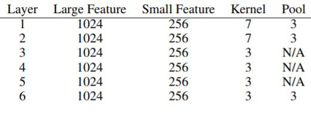
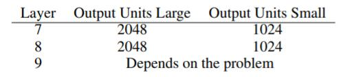

# Character-level Convolutional Networks for Text Classification

### Introduction

__character cnn을 사용하는 이유__
* cnn은 text의 문법, 의미적인 구조를 알려 하지 않는다(이전 연구 사례참고)
* 즉 단어에 대한 이해를 하려고 하지 않는다.
* character level cnn을 사용하면 비정상적인 단어(새로나온 단어, 오탈자)에 대해서도 자연스럽게 대응할 수 있다. 

### Character-level Convolution Networks

##### Key Modules

* 1-D convolution을 사용함(Image에서 사용하는 것과 유사)
* Max pooling
* ReLU 사용
* Momentum based SGD(batch size 128, m = 0.9)
* initial step size = 0.01, 3epoch마다 1/10로 줄임

##### Character Quantization
* one-hot encoding으로 character를 변환(고정 길이 L)
* L을 넘는 알파벳은 무시하고, 미리 정한 70개의 캐릭터에 포함되지 않는 것은 0으로 처리함
* 캐릭터 나열 순서를 역순으로 해서 FC레이어에서 최근 단어가 더 잘 반영되게?

##### Model Design
* 캐릭터 하나당 feature 수는 70(1-hot)
* sequence는 1014(대부분의 내용을 잡아낼 수 있음)

  

* gaussian distribution(0, 0,02)에서 initialize
* FC layer 사이에 dropout(0.5) 2번 사용
* 모든 conv layer의 stride는 1

##### Data augmentation using Thesaurus
* 유의어 사전에서 특정 문자를 대체시키는 방법으로 augmentation 사용
  
##### 기타 및 결론
* 큰 데이터셋에서는 character level convnet이 좋은 성능을 보임
* 작은 데이터에서는 ngrams tfidf 가 좋은 성능을 보임(전통적 방법)
* 작은 데이터셋이라 해도 train sample 최소 10만건 이상..
* 알파벳의 경우, 대소문자구분은 좋은 성능을 보이지않음(문법적인 의미가 달라지는 것이 아니기 때문으로 추정)
* user-generated data(좀 더 현실적인 data)에서 convnet이 더 잘 작동하는것으로 보이지만.. 실제로 이모티콘, 오탈자 같은 부분에서 더 잘 적용되는지는 좀 더 실험이 필요함 