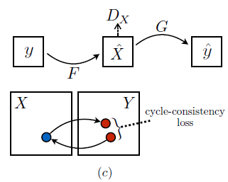

# Cycle Gan

### Introduction
* Image-to-Image translation : input image와 output image 사이의 mapping을 학습하는 것
* 기존 imate translation 연구 (예를 들면 pix2pix)는 paired dataset이 필요한데 현실 세계에서 이와 같은 dataset을 만들기는 정말 어렵다.
* 예를 들어, input으로 어떤 배경 사진을 넣었을 때 모네 화풍의 그림으로 바꿔주는 모델이 있다고 가정하면, 사진과 일치하는 모네의 그림이 쌍으로 존재해야 하는데 이런 dataset을 모으는 것은 거의 불가능하다고 할 수 있다.
* 이런 문제 때문에 unpaired dataset으로 image translation이 가능한지를 연구한 것이 이 논문의 내용이다.

### Formulation
##### Denote
* X : Input - {xi}i=1N
* Y : Output - {yi}i=1M
* pdata(x) : input의 distribution
* pdata(y) : output의 distribution
* model architecture  
  
* X에서 Y로 향하는 generator G와 Y에서 X로 향하는 generator F가 있고, 그에 따른 discriminator D가 2개 존재한다.

##### Adversarial Loss
기존 GAN의 loss와 동일한 것을 사용한다.   
  
cyclegan에서는 generator와 discriminator가 각각 2개씩 존재하고 그에 따라 mapping function이 2개이므로 각 경우에 대해서 loss를 계산한다.

1) G: X -> Y에 대해서   
minGmaxDy LGAN(G, DY, X, Y)
2) F: Y -> X에 대해서  
minFmaxDx LGAN(F, DX, Y, X)

##### Cycle Consistency Loss
  * GAN의 원리는 discriminator를 속일 수 있을 만큼의 output을 생성하는 generator를 만드는 것이다.
  * 하지만 network의 capacity가 충분하다면, 어떤 input을 넣더라도 임의의 output과 똑같은 output을 생성해 내게 된다(mode collapse)
  * 결국 adversarial loss는 낮지만 실제 우리가 원하는 output을 생성하지는 않을 수 있다. 
  * 이를 위해 cycle consistency라는 아이디어를 도입한 것인데.. 원리는 아래 식과 같다.  
   x -> G(x) -> F(G(x)) = x :forward cycle consistency  
   y -> F(y) -> G(F(y)) = y :backward cycle consistency
   즉, input x로 generate된 G(x)를 다시 backward generator F에 mapping 시켰을 때, 원본 x와 같은 이미지(원래대로 복원)가 나와야 한다는 것이다.  
   이를 반대로 적용해도 성립되어야 한다는 것을 loss로 표현한 것이 cycle consistency loss이다.  

   
   * cycle consistency loss   

   * 전체 loss는  

   * 여기서 $\lambda$ 는  hyperparameter이다.

### Implementation
* Network Architecture 
   * generator
      * stride 2 convolution
      * residual blocks
      * 1/2 fractionally strided convolution
      * instance normalization
   * discriminator
      * 70*70 patch gan

* Training detail
  * adversarial loss에 L2 loss 사용(LSGAN)
  * G training
    * (D(G(x)) - 1)2 minimize
  * D training
    * (D(y)-1)2 + D(G(x))2 minimize
  * $\lambda$ = 10
  * adam optimizer (lr = 0.0002)
  * 100 epoch lr 유지 , 다음 100 epoch에서 linear decay

