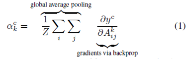
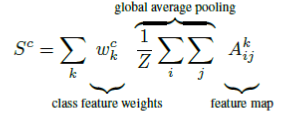
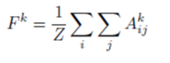
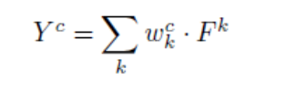
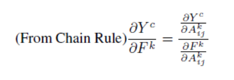
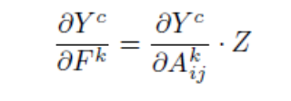
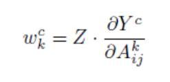
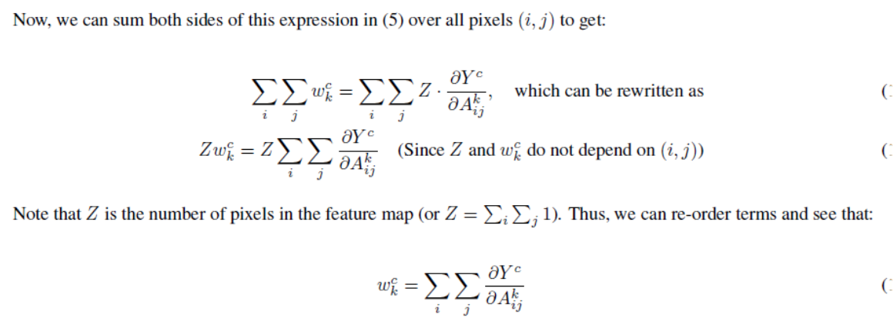

# Grad-CAM  

### Introduction

- CNN이 computer vision에서 많은 성과를 냈지만 모델의 복잡도 때문에 해석력은 떨어짐. 사용자들은 왜 모델이 이런 결과를 내는지 궁금해하게 됨
- accuracy와 interpretability 사이에는 분명 trade-off가 존재
- grad CAM은 기존의 Class Activation Map의 일반적인 버전
- 좋은 explanation은 class discriminative해야한다 -> class별로 정확히 구분되는 설명이 있어야 한다..?
- 그런 면에서 grad cam은 좋은 explanation 방법
 
 

### Approach 
- deep한 network가 고차원 feature를 잡아낸다는 것은 이미 알려진 사실
- 그렇기 때문에 마지막 convolution layer가 가장 구체적인 정보를 가지고 있을거라고 기대할 수 있다.
- grad cam은 마지막 convolution layer에 이은 gradient를 사용하여 각각의 뉴런이 의사결정에 얼마나 영향을 끼쳤는지를 알아낸다.  
  
- yc : 이미지의 forward값(softmax전)
- Akij : convolution layer의 feature map값
- 각 채널별로 gradient에 GAP 적용
- ack : convolution feature map 각 채널별 가중치
- 이 값과 feature map을 이용, linear combination하면 최종 heatmap을 위한 matrix 생성
- 이후 ReLU적용(positive 값만 관심있음)
- 이미지 사이즈와 동일하게 up sampling(bilinear interpolation)
  
CAM의 경우 마지막 convolution layer 이후 GAP를 적용하는 아키텍쳐에서만 가능한 구조인데, 이를 일반화해서 모든 network 구조에서 가능한 것이 grad-CAM이다.  
  
결국 gradcam에서의 a가 기존 cam에서 w와 같은 역할을 한다.
  
### Appendix : grad-CAM은 CAM의 일반화라는 것을 수식으로 증명

기존 CAM의 과정을 GAP부터 수식으로 보면,  
  
A는 feature map이고 Z는 이미지의 사이즈가 된다(k는 채널 수)  
최종 prediction 값(softmax 적용 전)은 아래와 같이 계산된다.   
  
결국 wck는 k번째 feature map에 대해 class c의 가중치가 된다.  
chain rule을 적용해서 Y를 미분하면  
  
  
  
w는 위와 같이 표현된다.  
Z는 feature map에서 pixel의 개수..
  

결국.. feature map x에 대해서 prediction은 Activation(wx)로 정의할 수 있는데,
x가 얼마나 영향을 끼쳤는지는 결국 w가 되고, 
때문에 cam처럼 GAP후 softmax에서는 단순 w가 gradient가 되지만
일반적인 architecture에서는 gradient를 사용하는 것(정확하지는 않음...)