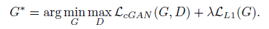
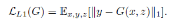
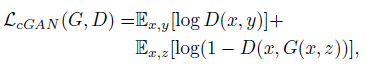

# Image to Image Translation with Conditional Adversarial Networks

### 1. Introduction
-  Image로부터 새로운 Image를 생성하는 기술은 예전부터 연구가 진행됬지만, 여러 문제가 발전을 가로막음
-  항상 원리는 똑같았음 : **pixel로부터 pixel을 예측**
-  CNN은 결국 loss function을 최소화하는 것, training은 자동으로 되지만.. 결국 효과적인 loss를 정의하는 것은 또다른 노력이 드는 문제이다.
- 예를 들어, pixel to pixel을 풀 때, 단순히 Euclidean distance를 loss로 사용하면 blurring 이미지가 생성된다.
- pix2pix는 Input image에 특정 condition을 줌으로써 이미지를 생성해 내는 cGAN과 유사한 기술

### 2. Related Work
- U-net 아키텍처를 차용함
  
### 3. Method
##### Objective
- GAN은 noise vector z -> output image y를 생성
- cGAN은 noise vector z + input x -> output image y를 생성
- pix2pix의 loss function은 아래와 같음  

- cGAN의 loss와 gan의 L1 loss를 합친 형태
- L2 loss를 gan에서 사용하면 ground truth 이미지와 유사한 이미지를 생성한다고 이전 논문에 나옴(LSGAN)
- 이런 효과와 더불어 L1을 사용하면 blur효과가 덜한 이미지를 생성해냄  
  

- noise를 input으로 넣으면 generator가 noise를 무시하는 경향이 생겨서 dropout형태로 몇몇 layer에 노이즈를 추가하는 방식을 취함

##### Network Architecture
- conv - batchnorm - relu 형식으로 module을 구성

##### Generator with skips
- low level의 information을 이용하기 위해 generator에서 skip connection을 적용함
- 이는 U-net architecture와 같음
- 전체 layer 수가 n일 때, i번째 layer의 information을 n-i번째 layer에 connect

##### Markovian discriminator (PatchGAN)
- L1 loss가 low frequency는 잘 잡지만, high frequency는 잘 잡지못함(detail을 말함)
- 이를 해결하기 위해 patchGAN 개념 도입
- 전체 image를 NxN의 patch로 나누어서 discriminator를 학습시킴
- 각 예측결과를 평균내서 최종 output을 계산함
- N이 작아질수록 high quality image를 생성하는 것을 확인
- N이 작아지면 paramter도 줄고, 속도도 빨라짐
- cnn 레이어 상단의 구조가 class개수가 아닌 n*n의 featuremap이라고 보면됨..

##### Optimization and inference
- 1 step D -> 1 step G (original gan과 똑같이)
- D의 object를 2로 나누어 학습 속도 조절