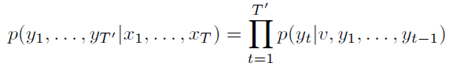

# Sequence to Sequence Learning with Neural Networks

### 1. Introduction

- DNN은 speech recognition, object recognition등에서 매우 강력한 성능을 보여준다.
- but DNN의 가장 큰 단점은, input 과 output의 dimension이 같아야 한다는 것이다.(fixed)
- 하지만 많은 문제들이 output의 length를 미리 알 수 는 없다.(특히 번역..)
- 이런 문제를 풀기 위해 seq2seq 제안
- seq2seq는 두개의 LSTM 으로 구성되어있는데, 하나는 input sequence를 하나의 vector representation으로 encoding하기 위한 것이고, 하나는 그 vector로부터 output sequence를 만들어 내는 것이다.
- 다른 모델을 선택할 수도 있지만, LSTM은 long term dependency가 있는 데이터도 잘 학습하기 때문에 자연스럽게 LSTM을 사용하게 되었다.
- input sentence를 역으로 순서를 바꿔서 학습시키면 성능이 매우 개선된다.(short term dependency가 많아지기 때문으로 추측)

### 2. Model
- RNN은 sequence 데이터를 mapping하기에 좋은 구조이지만, input size와 ouput size가 다를 때는 적용하기가 어렵다.
- 조경현 교수 등이 RNN으로 input을 fixed size vector로 매핑하고, 다른 RNN을 사용해서 target sequence로 매핑하는 구조를 제안했지만, RNN 자체는 long term dependency에 취약하다.
- 하지만 LSTM은 그런 문제를 해결한 모델이다.
- seq2seq의 목적식은 아래와 같다.  

- 각 sentence는 문장이 끝남을 의미하는 \<EOS> 가 마지막에 붙는다.
- 실제 모델은 2개의 LSTM을 사용한다.(각각 input과 output을 위한 것)
- LSTM의 레이어 수는 4
- input sentence를 역순으로 밀어넣는 것이 학습이 더 효과적임을 확인했다.

### 3. Experiments
##### 3.1 dataset detail
- WMT14 dataset 사용(ENG2FRE)
- source lang에 대해서는 160,000개의 단어, target lang에 대해서는 80,000개의 단어를 사용
- out of vocab에 대해서는 "UNK"로 처리
- log likelyhood를 최대화하는 방향으로 학습
##### 3.2 Reversing the source sentences
- source sentence를 역순으로 사용함으로써 성능 향상
- 정확한 이유는 모르겠지만, short term dependency가 많아졌기 때문으로 추측됨
- minimal time lag : sourece word와 target word간의 network상 거리가 먼 것을 말함
- source를 역순으로 사용하면 source와 target의 초반 단어 거리가 크게 줄어들기 때문에 좀 더 확실한 예측을 할 수 있음.
- 그만큼 뒤쪽단어의 거리는 멀어지지만 long sentence에서도 학습이 잘 되는 것을 실험으로 확인함(이유는 설명 못하는듯)

##### 3.4 training detail
- 4 layer LSTM (1000 cell, 1000 embedding size)
- uniform(-0.08, 0.08) initialize
- lr = 0.7 SGD 사용
- 5epoch 뒤 0.5epoch마다 lr 반으로 줄임
- 7.5epoch 학습
- batch size 128
- gradient exploding현상을 잡기 위해 G의 boundary를 둠(수식은 논문 참조)
- sentence간의 길이 편차가 심해 computation낭비 현상이 있음 이를 해결하기 위해 비슷한 길이의 sentence끼리 batch를 이루도록 조절