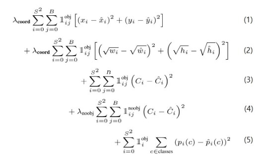

# Yolo

### **Introduction**

- 기존 RCNN 계열의 Detection 알고리즘과는 다르게 하나의 convolution network로 bounding box와 class probability를 예측할 수 있다. 
-	Yolo는 굉장히 빠르다. (45fps / tiny version 150 fps, titan X 기준)
-	예측할 때 전체 이미지를 사용한다.(기존 rcnn 에서는 Region proposal을 뽑아서 각각 예측을 했는데 이와 비교되는 것을 설명한 듯..) 때문에 class에 대한 이해도가 높다.
-	Object의 일반적인 feature를 학습한다. 
-	작은 object들이 여러 개 모여 있을 때 detection을 잘 하지 못한다.
***
### **Unified Detection**
-	하나의 네트워크로 여러 클래스의 여러 bbox를 예측 가능
-	이미지를 S*S크기의 grid로 나눈다.
-	각각의 grid cell에서 B개의 Bounding box와 confidence score를 예측하는 방식으로 설계
-	confidence core는 해당 box가 object를 포함하고 있는지를 나타낸다
Confidence Score : Pr(object) * IOU(truth, pred)
-	각각의 bounding box는 x, y, w, h, confidence 5개의 예측값을 가지고 있다.
x , y 는 grid cell의 범위의 상대적인 값(0~1사이)
w, h 는 전체 이미지 가로/세로에 대한 상대적인 값(0~1사이)
-	각각의 grid cell 별로 C(conditional class probability)를 예측값 으로 가진다.(주의 : bbox와는 관련 없음)
-	예측 값은 S*S*(B*5 + C) 형태의 tensor로 설계된다.(논문 실험에서는 S=7, B=2, C=20)

##### **Network Design**
-	Googlenet 아키텍처를 적용함
-	24개의 convolution layer + 2개의 FC layer(Fast yolo의 경우 9개의 convolution layer)

##### **Training**
-	Imagenet 1000 class 데이터로 convolution layer를 pre-training
-	Input image size는 448*448
-	모든 레이어에서 activation function은 leaky relu 사용
-	Cost function
    *	Sum squared error 사용
    * 단순 sse는 classification error와 localization error를 같은 비중으로 여김. 대부분의 grid cell은 object를 포함하고 있지 않으므로 object를 포함하고 있는 cell에 대한 gradient를 증폭시킴. 때문에 비중을 맞춰주는 hyperparameter 도입
    λ(coord) = 5, λ(noobj) = 0.5 사용 
    * 또한 sse는 큰 bbox의 error와 작은 bbox의 error을 동일한 비중으로 여김 이 역시 큰 bbox에서의 error가 차지하는 비중이 작아져야 하므로 w, h에 square root 사용
    * 전체 cost function 

        
##### **Inference**
[Yolo](https://goo.gl/byNZTn) 링크참고(NMS설명 포함됨)  
단순 max값 취하는 것이 아닌 NMS 사용하는 이유 -> 동일 클래스의 여러 물체를 찾기 위함.. 으로 보임
