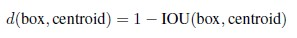
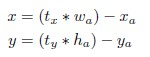

# **Yolo v2**

### **Introduction**
-	9000개의 catergory에 해당하는 이미지들을 detecting하는 알고리즘을 개발(yolo의 개선) 

### **Better**

1. Batch Normalization : 모든 convolution layer 뒤에 batch normalization layer를 추가하여 2%의 mAP 상승. Batchnorm 추가로 dropout layer는 제외했음
2. High Resolution Classifier
   1. 고해상도 이미지인 448 x 448 Imagenet 데이터에 대해 10epoch 학습시킨다.(classification problem에 최적화되지 않게 조금만 학습)
   2. 이 방법으로 상대적으로 고해상도 이미지에 잘 작동하도록 할 수 있다. 
3. Convolutional with Anchor Boxes
   1. 기존 yolo에서는 bbox의 좌표를 FC 레이어로 직접 예측함.
   2.  Faster Rcnn에서는 anchor box를 도입(filter의 중앙에서 1, 2, 1/1의 비율로 bbx생성)하고 실제 bbox와의 차이만을 예측함
   3. Input size를 416 x 416으로 조정하여 최종 feature map의 크기를 홀수로 만든다.(큰 object를 잘 찾기 위함)
   4. 기존 FC layer를 제외하고 1x1 convolution layer로 바꾼다.
   5. 각각의 1x1 convolution filter로 anchor box별 class probability, offset, confidence score를 계산함
   6. Anchor box를 사용하여 bbx 예측과 class 예측을 분리시켰음. mAP는 약간 낮아졌으나 recall이 88%로 7% 상승
   7. 기존 yolo에서는 grid별로 object의 class를 예측, yolo v2에서는 grid별로 할당된 anchor box의 class를 예측하게 됨

4. Dimension Clusters
   1. Faster rcnn에서는 anchor box의 비율을 임의로 정했지만, 보다 효율적인 비율을 정하기 위해 ground truth bbox를 clustering한다
   2. 모든 bbox의 centroid를 일치시켰을 때, IOU가 높은 box들끼리 클러스터링
   3. 
   4. IOU 높이기 위한 작업인데 실제로는 0.1올라감..

5. Direct Location Prediction
   1. Anchor box를 사용하면서 초기 training이 불안정해지는 문제가 있다. 이는 초기 박스의 위치가 너무 랜덤하게 예측되기 때문
   2.   
   3. 위 식에서 tx, ty는 convolution layer의 output인데, 1이면 앵커 박스 가로 길이만큼 오른쪽으로 이동한다.
   4. 이 부분을 해결하기 위해 기존 yolo에서 centroid를 그리드셀 내부에만 위치하도록 하는 것을 적용, 시그모이드 함수를 활용한다.

6. Fine Grained Features
   1. Yolo v2의 최종 output shape는 13 x 13인데, 이는 큰 물체를 잡기에는 충분하다. 하지만 작은 물체를 detection할 때 정확도가 떨어질 수 있는데, 이를 위해 이전 단계에서의 26 x 26 feature를 concat하여 사용한다. 기존 26x26x512 feature map을 13x13x2048 feature map으로 바꿔 concat

7. Multi Scale Training
   1. Yolo2는 FC layer가 없는 형태이기 때문에 어떤 크기의 input도 학습시킬 수 있다. 다양한 size의 데이터로 학습시킴으로서 보다 robust한 feature를 학습하게 했다.

###**Faster**

* Darknet-19
  * 네트워크 구조는 VGG와 유사하나, global average pooling을 prediction에 사용하고, 1x1 필터를 통해 feature를 압축, 연산속도를 빠르게 했다. 
  * Batchnorm을 사용
  * Training for classification
  * Imagenet 1000 class data에 대해서 160epochs 학습
  * Sgd(lr = 0.1) polynomial rate decay(power = 4) / momentum 0.9
  * Random crop, rotation, hue, saturation, exposure shifts..
  * 먼저 224x224 이미지에 대해 학습한 후, 448 이미지에 대해 10epoch만 fine tuning을 진행
  * Top-1 accuracy 76.5% top-5 accuracy 93.3%
* Training for detection
  * 마지막 convolution layer를 제거하고, 3개의 3x3 convolution layer를 추가한다(filter 개수 1024) 마지막에 1x1 layer를 추가해서 output의 개수만큼 filter 개수를 지정한다.  
  VOC 데이터의 경우, 20개의 클래스에 대해 grid cell별 5개의 bbox,와 각 bbox별 5개의 coordinates(x, y, w, h, confidence)가 있으므로 총 125개의 filter가 필요하다
  * 3x3x512 레이어를 passthrough 레이어로 이용, 마지막 convolution layer에 추가
